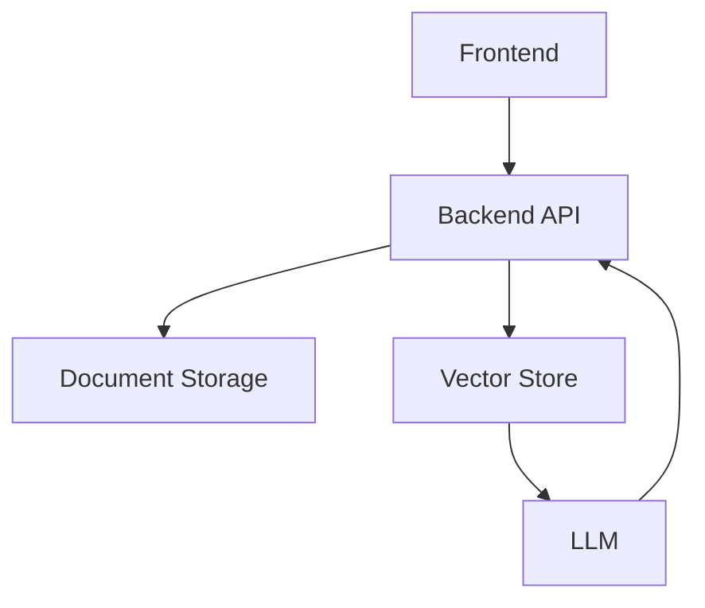

# Sistem Mimarisi

Bu doküman, sistemin genel mimarisini ve temel bileşenlerini özetler.

## Genel Mimari Yaklaşım
Sistem, web tabanlı ve servis odaklı bir mimariyle tasarlanmıştır.

Frontend, backend üzerinden API çağrıları yapar.
Backend hem klasik yazılım bileşenlerini hem de AI destekli modülleri içerir.

## Bileşenler

- Frontend (Web UI)
- Backend API (FastAPI)
- Doküman Depolama
- Vektör Tabanlı Arama (FAISS / benzeri)
- Büyük Dil Modeli (LLM)

## Basit Bileşen Diyagramı (Component Diagram)

## AI Kullanım Sınırı

Doküman yükleme, saklama ve anahtar kelime araması klasik yazılım yöntemleriyle yapılır

AI yalnızca:

Özetleme

Dokümana dayalı soru-cevap
işlemlerinde kullanılır

Bu ayrım, yapay zekânın hata riskini kontrol altında tutmak amacıyla bilinçli olarak yapılmıştır.